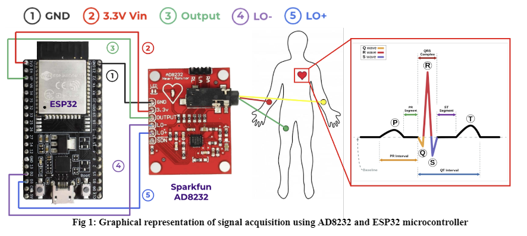
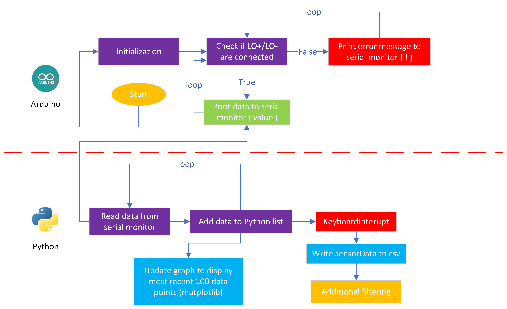

<h1>Realtime ECG Acquisition</h1>

<h2>Overview</h2>
    

        In this project, we developed an open-source, low-cost realtime ECG monitoring solution using the AD8232 ECG module by Sparkfun and ESP32 chip using Arduino and Python. 
      
    

        </img>
    

    
 
<h2>Code</h2>

    To enable ECG data collection using our hardware implementation from any individual, an Arduino script must first be uploaded to the ESP32 module. Since the default Arduino IDE that we used to accomplish this lacks the ability to store data directly, our next step was adding data storage functionality using external hardware components or third-party software. Additionally, we wished to implement real-time monitoring functionality into our system to increase the applicability of our system to a health-care-oriented scenario. Real-time visualization of an ECG signal can immediately detect cardiac abnormalities such as arrhythmias and allow healthcare professionals to provide diagnoses and respond accordingly quickly.  
    
We used a Python script to run simultaneously with the Arduino script to accomplish the data storage and visualization tasks for our software implementation. The rationale for this is that Python is a readily accessible open-source programming language and has several powerful packages that can be utilized to perform real-time visualization, such as Matplotlib, which fits into our overarching goal of creating an efficient cost-effective real-time ECG monitoring solution.  

As illustrated in block diagram below, in the Arduino component of our software implementation, once uploaded, the script will begin to check whether the LO+/LO- pins are connected properly. In other words, this means that the script checks whether the ECG leads are connected. If they are, the script will begin printing analog values to the Arduino serial monitor; if not, an error message will be printed instead. Once run, the Python component continuously reads the output of the Arduino serial monitor. The serial monitor output is decoded using UTF-8 and converted to an integer stored in a list. The most recent 100 points of this list are then graphed in real-time by using Matplotlib’s animation base class. Once the KeyboardInterupt is performed in the Python script, the graphing ceases, and the collected data is stored in a .csv file, which can be used for additional data processing.

    </img>

<h2>Materials Needed</h2>
<ul>
    <li>Sparkfun AD8232 ECG Module</li>
    <li>ESP-32 Chip</li>
    <li>ECG leads + electrodes</li>
    <li>USB connector</li>

</ul>
<h2>Usage</h2>
    

    <ol>
        <li>Place electrodes / lead connections on a subject in a suitable configuration. </li>
        <li>Connect the lead wire to the AD8232 ECG module,</li> 
        <li>Upload Arduino code to the ESP32 using the Arduino IDE (the ECG signal should be collecting once this is finished, you may open the serial monitor/plotter to confirm).</li>
        <li>Make sure that serial monitor/plotter in Arduino is closed and run the Python script.</li>
        <li>Once data collection is sufficient, perform keyboard interuption in Python (ctrl+c), which will stop the loop and write sensor data to a .csv file. </li>
    </ol>
    
 

<h2>Installations</h2>
    

        <ol>
            <li>
                To implement this system for yourself, you must first install a 
                    <a href="https://www.silabs.com/developers/usb-to-uart-bridge-vcp-drivers?tab=downloads"> VCP Driver
                    </a> 
                for device operation over a virtual COM port. 
            </li>
            <li>

                Next, you must install the correct virtual COM corresponding to your choice of board within the Arduino IDE (in our case, ESP32).
            
</li>
        </ol>
    
 

<h2>Future Directions</h2>
    

        <ul>
        <li>Real-time filter functionality.</li>
        <li>Different choice of board.</li>
        <li>Dedicated housing for electronic components.</li>
        </ul>
    
 

<h2>Contributors</h2>
<ul>
    <li>Nanzhong Deng</li>
    <li>Neil Sequeira</li>
    <li>Lokesh Sharma</li>
    <li>Dorian Yeh</li>
</ul>
